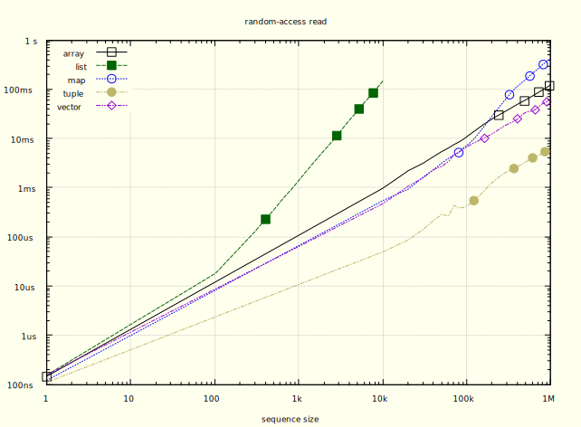
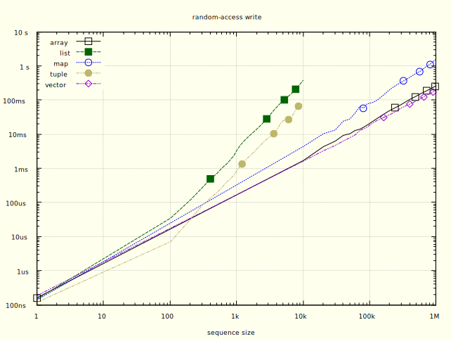
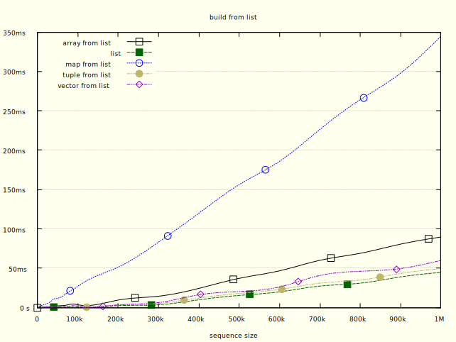
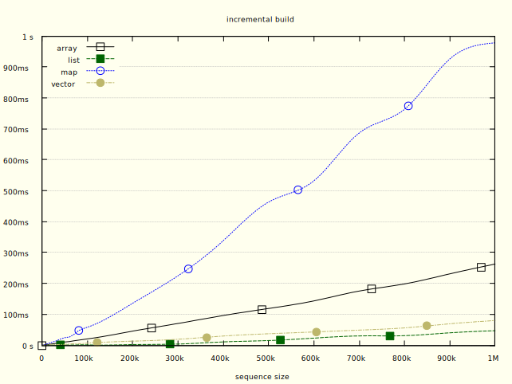
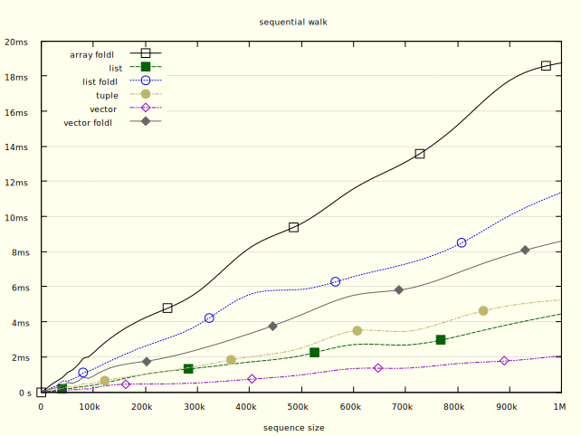

# Sequences benchmarking

The following benchmarks are based on the ones from this
[article on the Erlangelist blog](https://www.theerlangelist.com/article/sequences)
and have been adjusted to include Aja's `A.Vector`.

The source can be found on
[this fork](https://github.com/sabiwara/erlangelist/).

## Random access

```elixir
A.Vector.at!(vector, i)
```



Without surprise, the tuple is the fastest option for read-random access by an
order of magnitude. If the use case is read-intensive and doesn't need any
write, tuples are the way to go.

`A.Vector` are the fastest persistent option here, slighlty better than `:array`
as the size grows due to a biggest branching factor (16 vs 10).

Lists are the slowest option as expected since the cost is linear.

```elixir
A.Vector.replace_at!(vector, i, value)
```

`A.Vector` and `:array` both share the first place here, without any significant
difference.

Tuples and lists have linear costs here and are not viable options.



## Building

```elixir
A.Vector.new(list)
```



```elixir
# in a recursive function
A.Vector.append(vector, value)
```



## Walking

```elixir
# generic fold
A.Vector.foldl(vector, 0, & &1 + &2)
A.Enum.reduce(vector, 0, & &1 + &2)

# specialized Enum function
A.Enum.sum(vector)
```



It is important to note that specialized functions manually written using
recursion are notably faster than the generic versions using folds (`foldl`,
`reduce`), so we split the categories here.

`A.Vector` really shines here, being both the faster way to fold over a sequence
or the fastest for specialized functions when using the `A.Enum` module.

`A.Vector` is fastest than lists and tuples (especially since the OTP 24 JIT).

`:array`, which doesn't provide specialized functions and only has the fold
option, is an order of magnitude slower.
